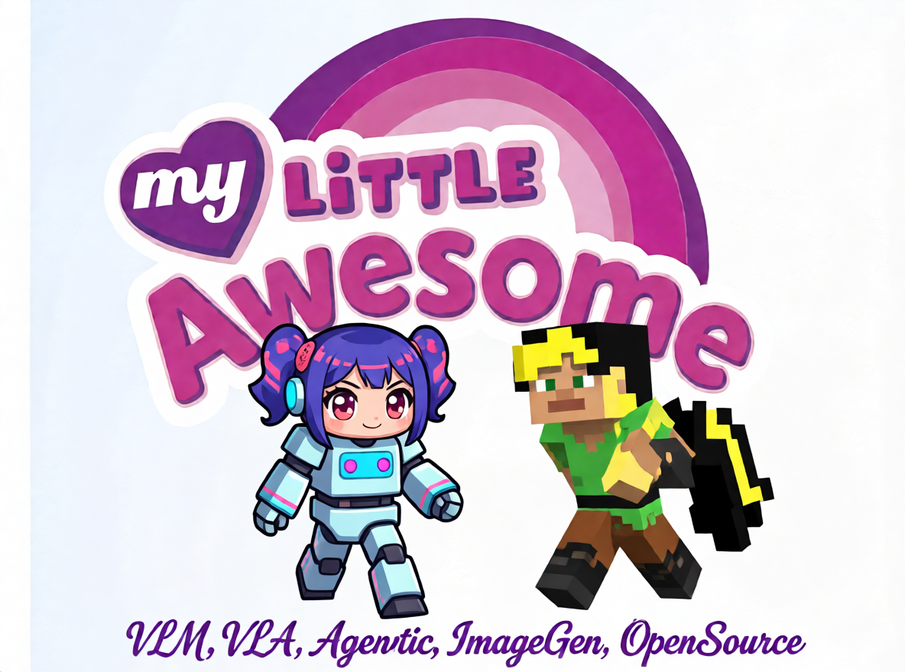

# My Little Awesome

Some AI Awesome Project list I've tried to use. Some my metrics attached, not all described (repo initially was for own purpose).

*this cool \*\*\*\* was generated with❤️ by QwenIE 2511*

My choose focus: Open source & preferably free or low cost, local-running, actual

Actual: 06.2025 (or maybe older) + little 05.01.2026 additions

> All PR's and your foundations are VERY welcome!

**General**
---

[LEADERBOARDS AWESOME](https://github.com/SAILResearch/awesome-foundation-model-leaderboards?tab=readme-ov-file#image)

**Agentic**
---

## Minecraft agents

(VLA or fast pipelines)

Good awesome summary [here](https://github.com/lizaijing/Awesome-Minecraft-Agent)

- Optimus 3
  - Works best for my scenario with AutoClef client minecraft agent, but I still don't know if it's random or prompt-following... It ignores instructions but looks like understands the game
- Jarvis VLA
  - other [CraftJarvis](https://craftjarvis.github.io/projects/) projects
- Nvidia [NitroGEN](https://huggingface.co/nvidia/NitroGen)

  TODO глянуть, выглядит быстрой лёгкой и интересной! 
- DreamerV3
  - Will hard to implement, fully autonomous pipeline without direct goal conditioning, TODO test with client minecraft but looks unrealistic for now
- Game TARS (wait for releasing their [weights](https://huggingface.co/ByteDance-Seed/collections)!), [should](https://gemini.google.com/share/37ef0a61c389) be good VLA instead of their computer-use slow agentic VLM

## Computer-use agents

- [ByteDance UI TARS](https://github.com/bytedance/UI-TARS-desktop)
  Apache, SOTA?, very big and complex

  - Tested locally UI TARS 1.5 - fast & good, can simply play flash games and EVEN 100x slown-motioned minecraft
    - Launched on Agent TARS windows release 2.x versions
    - Has TERRIBLE repeating problem & ZERO reflection
    - still slow for realtime actioning

- Microsoft GUI Actor & Verifier & Critic
  old? Non-sota?
  Fara 7B? Fast but untested

- computer_use_ootb
  bad working, easy architecture, many platforms

## OpenSource Local LLM RU

vsegpt ru - nice for few test runs

- Sainemo Remix I1 Q4
  Overall good, better RU
  нашёл советы по параметрам: [отсюда](https://huggingface.co/Moraliane/SAINEMO-reMIX)
- Saiga Nemo 12B Q4
  Super entertain, mid quality, better RU
- Gemma 3 12B Q4
  Overall good, normal RU, VISION
- Qwen 3 8B, 12B Q4
  worse entertain, SOTA metrics, mid RU
- WAITING for weights of Gamayun RU LLM ([paper](https://arxiv.org/abs/2512.21580)), should be interesting
- FRED-T5-1.7B (FRED-T5-XL) Very GOOD creative multitask model but TOO OLD (T5 EncDec + GPT2 BPE tokenizer) + cannot convert to gguf
  - Best FineTune is SiberianFred

[неплохие адаптации и ремиксы моделей под ру](https://huggingface.co/Moraliane), сайга понравилась, остальные не знаю. + Устарел и не обновляется.

[адаптация квенов под ру](https://huggingface.co/RefalMachine). В проде не запомнился, причин не помню, но занял место в старом лидерборде vikhrmodels

## API LLM

Main famous - [LMsys leaderboard](https://lmarena.ai/leaderboard)

[AA Leaderboard](https://huggingface.co/spaces/ArtificialAnalysis/LLM-Performance-Leaderboard)

## OpenSource Embeddings

[outdated]

- user bge m3
  ru, tested, understanding, medium size
- nomic
  mostly en, tiny, ru poor quality

## Agentic Workflow

[outdated]

- python + langchain
- n8n
- [Google Opal](https://www.youtube.com/watch?v=ThP1pObOtPg&ab_channel=MAKAROV)?

**Media**
---

## Multimodal discussion

[MAY BE OUTDATED]

- [VideoXL](https://github.com/VectorSpaceLab/Video-XL/tree/main/Video-XL-2) SOTA for hour videos
- Gemma 3n only python image, video, audio, not precise
- InternVL3 Precize
- Qwen 2.5VL medium, partly precise

## Face Swap

[MAY BE OUTDATED]

- [FaseFusion](https://github.com/facefusion/facefusion)
  slow SOTA FaceSwap, OpenRAIL license, Docker Use, Commerical added
  [install](https://docs.facefusion.io/installation), webcam [use](https://docs.facefusion.io/usage/deepfake-webcam)

- DeepLiveCam
  normal but need fix after install
- [DeepFaceLive](https://github.com/iperov/DeepFaceLive) & [DeepFaceLab](https://github.com/iperov/DeepFaceLab)
  Old archived VERY functional FaceSwap, not work for now? untested fork: MachineEditor/DeepFaceLab-MVE

## VideoGen

- LTX-2 opensource
  
  semi-OS license, fast, SOUND-gen
  - Min 16G VRAM
  - buggy but prompt-following
- Wan 2.2
  Commerical use allowed, VERY high quality, TOO weak hard prompt following (and sometimes simple...)
  - Best implementation - Phr00t/wan aio
  - Best on ~24G VRAM, can work on 16G and sometimes on 8G

## ImageGen

[imgsys ld](https://imgsys.org/), [AA Leaderboard](https://huggingface.co/spaces/ArtificialAnalysis/Text-to-Image-Leaderboard)

- Perchance AI
  web, free, not censured, looks like old Stable Diffusion 1.5+lora. Chroma-based?
- Qwen Image Edit
  comfyui, 90s (50s with 4step fusion lora), edit, weak censure, good prompt follow **PROD-USEABLE for few changes**
  - QwenIE 2511 MUCH BETTER
- ZImage
  - Good Txt2Img, Bad controlnet, full uncensored
- Flux2 dev
  - TOO resource-intensive, good quality, a bit censored (in prompt-following)

## TTS ru

- FishSpeech
  
  for now the best for RU, good accents, but non-commerical weights license
  - 1.5 good but fast on CUDA-only
  - s1-mini same but maybe worse...
- Silero
  
  very fast
  - Limited voicelist

## Licenses understanding

Good understandable explanations <https://choosealicense.com/licenses/>

Commerical use allowed: Public domain, The Unlicense, Apache 2.0, MIT, ISC, GNU General Public License (Need same license): GNU LGPLv3, GNU AGPLv3, GNU GPLv3; Mozilla Public License 2.0, Boost Software License 1.0, CC (any without NC; ND & SA - same license-like restrictions) ...
> Most of them need notices
